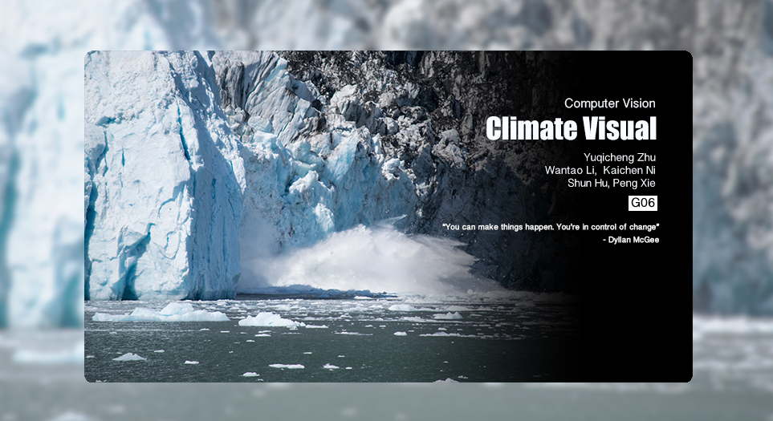
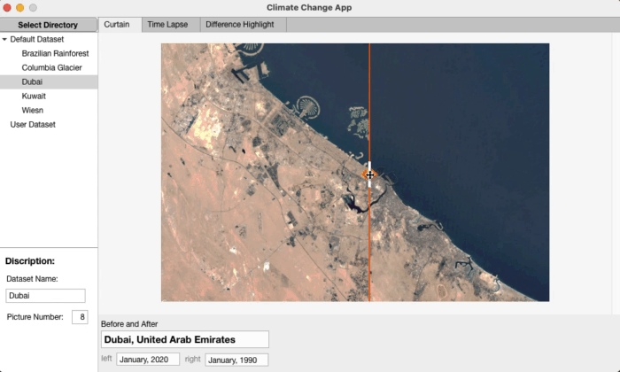
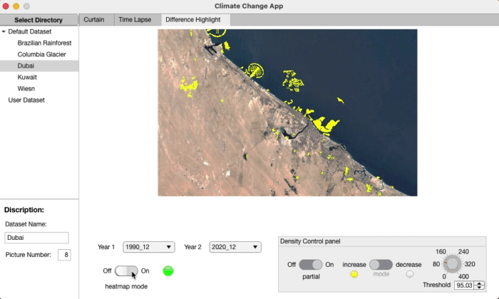

# Climate Visual Project

## Introduction

> For full Video please click this [link](https://youtu.be/NJxtTB5WAwM).

It is the repository of the final challenge project for Computer Vision (SS21) at Technical University Munich.

> **Lecturer**: Prof. Dr.-Ing. Klaus Diepold
>
> **Assistant**: Luca Sacchetto, Stefan Röhrl
>
> **Team Member**:
>
> - Yuqicheng Zhu
> - Wantao Li
> - Shun Hu
> - Kaichen Ni
> - Peng Xie

The content of the lecture contains:

- video analysis
- image synthesis
- Harris Corners
- Estimation Algorithms
- image rectification
- essential matrix and fundamental matrix
- epipolar geometry
- 8-point algorithm
- 3D reconstruction, planar epipolar equation
- 4-point algorithm
- multi-camera systems
- coordinate transformations
- robust parameter estimation (RanSaC)
- machine learning

In the last decades, the impact of mankind on our environment has greatly gained in significance. From shrinking glaciers and rising temperatures through the rapid deforestation of the world’s most important forests to the construction of mega-projects, our attempts at shaping the earth haven’t always had positive consequences. Satellite imagery may prove to be an effective tool to detect, analyse and document large changes in the environment. This provides a basis to identify end eventually temper negative repercussions of such changes. Therefore, this Computer Vision Challenge involves the analysis of satellite images, which were taken at different points in time and from different points of view. Consequently, the aim is to visualize large changes in these images.

---

## GUI User's Guide

> :computer: : should work both for **WINDOWS** and **MAC**
>
> :rocket: MATLAB Version: at least **MATLAB R2020b**

### **Difference Curtain**

We want to show two different pictures on one picture to give users a more intuitive feeling. Our app has a swiping curtain. In the left and right sides there are two different images so we can easily see the comparison. And through swiping the curtain a better UI experience could be achieved.

### **Time lapse**

we design a timelapse which shows the whole set of pictures. User could select which image they want to review by simply clicking on the button. Also, we set a function which enables automatically playing the whole set of results.

### **Difference Highlight**

To detect land changes based on intensity, we need to do a median filtering at first, which reduces the band noises and improves the quality of the images significantly. After the prefiltering, we can detect the changes easily by subtraction of the two images. We ignore the small changes and remove the small objects from the binary image.

The yellow areas show the increase area, and the red areas represent the decreased area. You can adjust the density of the highlight-area by turning the threshold wheel on the right.

You can also visualize the increased/decreased area separately.

### **Difference Highlight - heatmap**

You can visualize the change level through heatmap.

